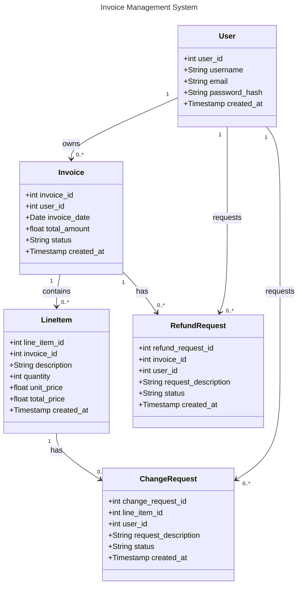

### Class Diagram:



### Prompts:

```
Translate the #file:migrations.sql into class diagrams for users, invoices, change requests and refund requests considering following mermaid format

---
title: Bank example
---
classDiagram
    class BankAccount
    BankAccount : +String owner
    BankAccount : +Bigdecimal balance
    BankAccount : +deposit(amount)
    BankAccount : +withdrawal(amount)
```