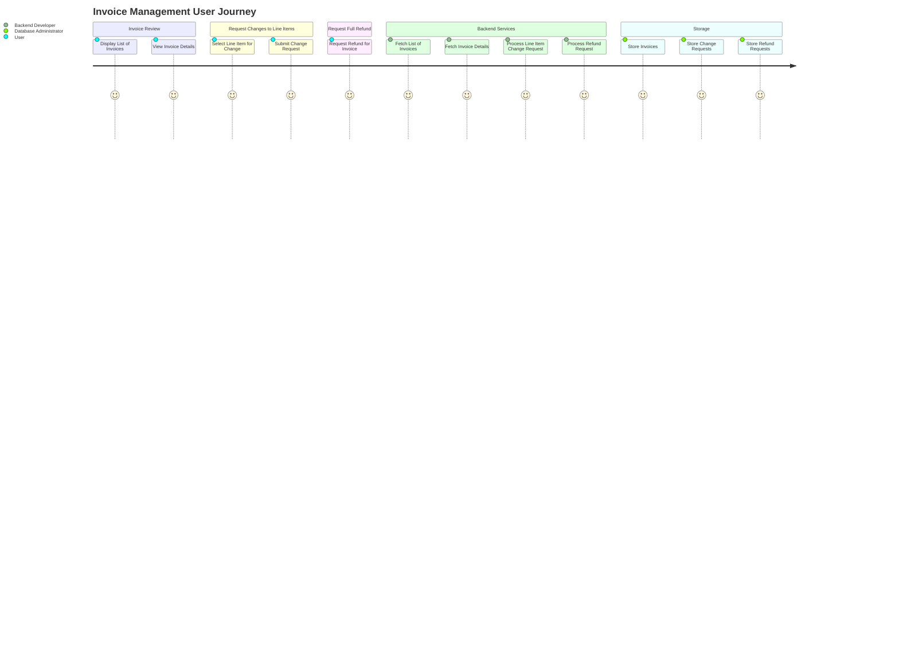

### User Journey:



### Prompts:

```
Translate the #file:feature-requirement.md into a user journey
considering following mermaid format:

journey
    title My working day
    section Go to work
      Make tea: 5: Me
      Go upstairs: 3: Me
      Do work: 1: Me, Cat
    section Go home
      Go downstairs: 5: Me
      Sit down: 5: Me
```